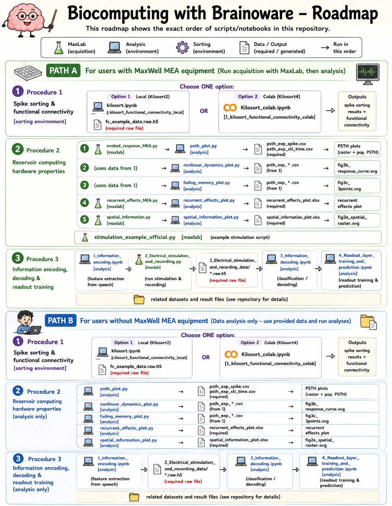

# Biocomputing with Brainoware - Code Repository

This repository contains the code implementation for the Brainoware.

## Overview
This GITHUB code repository provides code and resources related to Brainoware's hardware properties and software framework as described in the associated Nature Protocols paper submission.

## Contents
- Procedure 1 — Spike sorting & functional connectivity [**sorting environment**] (see [`procedure_1/README.md`](procedure_1/README.md))
    - 1_kilosort_functional_connectivity_local
        - kilosort.ipynb — spike sorting (Kilosort2) + functional connectivity, run locally
        - fc_example_data.raw.h5 [**required raw file**; download [here](https://www.dropbox.com/scl/fi/yuw74vcwpnr5bnj7juy1w/fc_example_data.raw.h5?rlkey=0ry7a9fmdssw2b451k6k6l7h1&st=dzrdfhrv&dl=0) and save under this directory]
    - 1_kilosort_functional_connectivity_colab
        - Kilosort_colab.ipynb — spike sorting (Kilosort4) + functional connectivity, run in Google Colab ([Open In Colab](https://colab.research.google.com/drive/1e2R7HG9jlgmnkg3S3OtvWFQ2vGpSd6Ej?usp=sharing))
- Procedure 2 — Reservoir computing hardware properties
    - 1_evoked_response
        - evoked_response_MEA.py [**maxlab environment**]
        - psth_plot.py [**analysis environment**] — reads the spike/stimulation files and plots the PSTH (raster + population PSTH) of the evoked response
        - psth_exp_spike.csv [**required raw file for analysis**]
        - psth_exp_sti_time.csv [**required raw file for analysis**]
        - result plots and files generated by psth_plot.py
    - 2_non_linear_dynamics
        - nonlinear_dynamics_plot.py [**analysis environment**] — dose-response curves (normalized firing vs stimulation intensity), one per pulse duration, with a fitted sigmoid; reads `psth_exp_*.csv` from `1_evoked_response`
        - fig3b_response_curve.svg [generated by nonlinear_dynamics_plot.py]
    - 3_fading_memory
        - fading_memory_plot.py [**analysis environment**] — normalized firing across successive post-stimulus time windows (peak → fade) for several intensities; reads `psth_exp_*.csv` from `1_evoked_response`
        - fig3c_3points.svg [generated by fading_memory_plot.py]
    - 4_recurrent_effects
        - recurrent_effects_MEA.py [**maxlab environment**]
        - recurrent_effects_plot.py [**analysis environment**] — normalized firing across a pulse train of increasing pulse number (recurrent facilitation)
        - recurrent_effects_plot.xlsx [**required data file for analysis**]
        - result plot generated by recurrent_effects_plot.py
    - 5_spatial_information
        - spatial_information.py [**maxlab environment**]
        - spatial_information_plot.py [**analysis environment**] — raster/heatmap of the evoked responses to the two complementary stimulation patterns
        - spatial_information_plot.xlsx [**required data file for analysis**]
        - fig2e_spatial_raster.svg [generated by spatial_information_plot.py]
    - stimulation_example_official.py [**maxlab environment**]
- Procedure 3
    - 1_information_encoding.ipynb [**analysis environment**]
    - 2_Electrical_stimulation_and_recording.py [**maxlab environment**]
    - 2_Electrical_stimulation_and_recording_data [**required raw recording file**]

        *.raw.h5 [download [here](https://www.dropbox.com/scl/fi/9gpkh0zhfyohkyl930hl1/speech_recognition_10hz_25990.raw.h5?rlkey=vwv0s5lokkztswr0zrn2si2eu&st=6hxtab5y&dl=0) and save under this directory]
    - 3_Information_decoding.ipynb [**analysis environment**]
    - 4_Readout_layer_training_and_prediction.ipynb [**analysis environment**]
    - related datasets and result files
## Requirements

This protocol uses three separate environments. The exact versions we tested on are listed below.

### sorting environment

Used for Procedure 1 (spike sorting with Kilosort + functional connectivity). Two interchangeable options are provided — see [`procedure_1/README.md`](procedure_1/README.md) for full setup instructions.

| Option | Sorter | Key requirements |
|--------|--------|------------------|
| **Local** (`kilosort.ipynb`) | Kilosort2 | MATLAB + required toolboxes, a MATLAB-compatible C++ compiler (Windows: Visual Studio Community 2017; Linux/macOS: `g++`), a CUDA-capable NVIDIA GPU (CUDA mex files compiled via `mexGPUall`), Python 3.8+ with `spikeinterface`, `numpy`, `pandas`, `matplotlib`, `networkx`, `numba`, `plotly`, `h5py` |
| **Colab** (`Kilosort_colab.ipynb`) | Kilosort4 | Google Colab GPU runtime with High RAM (>40 GB, e.g. A100/H100); all dependencies installed automatically by the notebook |

### maxlab environment
| Software | Version |
|----------|---------|
| MaxLab Live software | 25.1.8.2 (63ce7015b) |
| Python | 3.8.10 |
| Conda | 24.5.0 |
| maxlab | provided by MaxWell Biosystems |

### analysis environment
Created from the provided `environment.yml`. Core packages and pinned versions:

| Package | Version |
|---------|---------|
| Python | 3.7 |
| h5py | 3.7.0 |
| matplotlib | 3.5.3 |
| numpy | 1.21.5 |
| pandas | 1.3.5 |
| scikit-learn | 1.0.2 |
| scipy | 1.7.3 |
| librosa | 0.8.1 |
| spykes | - |
| seaborn | - |
| openpyxl | - |

See [`environment.yml`](environment.yml) for the authoritative dependency list. `seaborn` and `openpyxl` are used by the Procedure 2 plotting scripts (`5_spatial_information` raster and the `.xlsx` readers in `4_recurrent_effects`/`5_spatial_information`); install with `pip install seaborn openpyxl` if not already present.

## Getting Started

In this protocol, three environments are required to finish all steps:
- sorting environment

    Environment for Procedure 1 (spike sorting with Kilosort + functional connectivity). You can either run the **local** notebook (`kilosort.ipynb`, Kilosort2 — needs MATLAB, a C++ compiler, and a CUDA NVIDIA GPU) or the **Colab** notebook (`Kilosort_colab.ipynb`, Kilosort4 — runs on a Google Colab GPU + High RAM runtime with no local setup). See [`procedure_1/README.md`](procedure_1/README.md) for step-by-step instructions.

- maxlab environment

    Global Python environment on the PC that connects to the MaxOne High-Density Microelectrode Array (HD-MEA) System. This environment requires *maxlab*, a Python MEA stimulation library developed by MaxWell biosystems, pre-installed in the system Python package directory (…/python3.8/site-packages/maxlab) to enable electrical stimulation on the MaxOne MEA recording unit through a Python script. Ask [MaxWell biosystems](https://www.mxwbio.com/) for help with maxlab environment setup (info@mxwbio.com)

    In this repository, we have provided raw data resources so that you can still run through all analysis steps without dealing with maxlab environment. For the huge raw recording file, download it to the required directory by following the instructions in the [Contents](#contents) part. 

- analysis environment

    Conda-based Python virtual environment for data analysis. This can be set up in any device with conda installed (See conda webpage for detailed installation guide: https://docs.conda.io/projects/conda/en/latest/index.html)

    After conda is installed:
    1. Download or clone this repository
    2. Open the Anaconda prompt and change directory to this repository
    3. Add conda-forge channel
        ```bash
        conda config --add channels conda-forge
        ```
        **for MacOS user, also run this line:**
        ```bash
        conda config --env --set subdir osx-64
        # In macOS, Conda no longer builds or keeps Python 3.7 because it’s end-of-life. When you run this line, you force Conda to use the older Intel macOS (osx-64) repository, where Python 3.7 packages still exist, so the installation succeeds even though it’s effectively using a legacy platform.
        ```
    4. Create a new virtual environment using the provided environment.yml file in the root of the repository 
    **[Don't forget to change the directory to this repository!]**
        ```bash
        conda env create --name brainoware_analysis -f environment.yml
        ``` 
    5. Activate the created analysis environment
        ```bash
        conda activate brainoware_analysis
        ```
    6. Manually install spykes [credits: [KordingLab](https://github.com/KordingLab/spykes)]
        ```bash
        pip install -e spykes-master
        ```
    7. Install jupyter notebook, ipykernel, and register the kernel in the jupyter notebook
        ```bash
        pip install notebook
        pip install ipykernel
        python -m ipykernel install --user --name=brainoware_analysis --display-name "Python (brainoware_analysis)"
        ```
    8. For files with *.py suffix, run
        ```bash
        python *.py
        ```
        e.g. procedure_2/1_evoked_response/psth_plot.py
    9. For files with *.ipynb suffix, run
        ```bash
        jupyter notebook *.ipynb
        ```
        e.g. procedure_3/1_Information_encoding.ipynb
        
        After entering the notebook page, select brainoware_analysis kernel in the upper right corner of the page (or in the navigation bar -  kernel - change kernel) and run the code one block by one block.
    10. Execution order of analysis environment
        - procedure_2/1_evoked_response/psth_plot.py
        - procedure_2/2_non_linear_dynamics/nonlinear_dynamics_plot.py
        - procedure_2/3_fading_memory/fading_memory_plot.py
        - procedure_2/4_recurrent_effects/recurrent_effects_plot.py
        - procedure_2/5_spatial_information/spatial_information_plot.py
        - procedure_3/1_Information_encoding.ipynb
        - procedure_3/3_Information_decoding.ipynb
        - procedure_3/4_Readout_layer_training_and_prediction.ipynb

## Citation
[](https://doi.org/10.5281/zenodo.21083191)  
If you're using this repository in your research, please cite the repository and associated Nature Protocols article.

## License
See LICENSE file for details.
